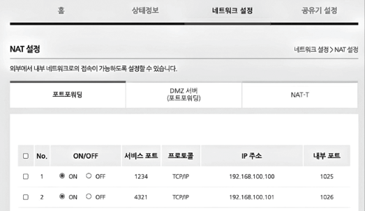

# Cloud Formation

## 개요&#x20;

> AWS 리소스 생성 및 배포 자동화 템플릿 서비스입니다.

* AWS 리소스를 모델링하고 설정합니다.&#x20;
  * 리소스 관리 시간을 줄일 수 있습니다.
* AWS 리소스를 설명하는 템플릿(=코드)를 생성하면 리소스의 프로비저닝과 구성을 담당합니다.&#x20;

## 동작 원리&#x20;

<figure><figcaption></figcaption></figure>

1. Cloud Front에서 실행하는 호출은 모두 템플릿으로 선언됩니다.&#x20;
2. 해당 템플릿을 local이나 S3에 저장합니다.&#x20;
3. Cloudformation에서 템플릿을 활용해 AWS 리소스를 생성하고 스택을 생성합니다.&#x20;

## 장점&#x20;

### 인프라 관리 간소화&#x20;

> 리소스 모음을 단일 단위(스택)으로 쉽게 관리할 수 있습니다.&#x20;

#### 기존 방식&#x20;

각 개별 서비스를 사용하여 프로비저닝해야하고 서비스간 연동을 진행해야합니다. 모든 작업을 마치고 애플리케이션을 제대로 실행하려면 복잡하고 많은 시간이 소요됩니다.&#x20;

#### CloudFormation에서는&#x20;

모든 리소스와 속성을 설명하는 템플릿을 사용합니다. 템플릿을 사용하여 Cloudfront에서 스택을 생성할 경우 필요한 서비스를 자동으로 프로비저닝합니다. 스택의 삭제, 관리가 용이합니다.

### 신속하게 인프라 복제&#x20;

> 가용성을 확대해야하는 경우 여러 리전에서 애플리케이션을 복제할 수 있습니다.&#x20;

#### 기존 방식&#x20;

복제시, 애플리케이션에 필요한 모든 AWS 서비스를 알아야하고, 각 리전에서 해당 서비스를 다시 구성해야합니다.&#x20;

#### CloudFormation에서는&#x20;

템플릿을 재사용하여 리소스를 일관되고 반복적으로 생산할 수 있습니다. 또한 여러 리전에서 동일한 리소스를 반복적으로 프로비저닝할 수 있습니다.&#x20;

### 인프라 변경 사항을 쉽게 제어 및 추적&#x20;

#### 기존 방식&#x20;

애플리케이션을 업데이트하고 문제가 발생할 경우 원래 설정으로 롤백해야합니다. 변경된 리소스를 기억하고 원래 설정을 알고 다시 수동으로 복구해야합니다.&#x20;

#### CloudFormation에서는&#x20;

템플릿에서 차이점을 추적하여 인프라 변경사항을 추적할 수 있습니다. 형상관리시스템(git)을 활용하여 변경 내용, 변경 시간, 변경한 사람을 정확히 알 수 있습니다. 이전 버전으로 되돌려야할 경우 이전 버전의 템플릿을 사용하면 됩니다.&#x20;

### 단점&#x20;

* 리소스에 대한 이해가 낮으면 사용하기가 어렵습니다.&#x20;
* 배포에 필요한 모든 옵션을 직접 활용하기에는 설정이 많습니다.&#x20;
* json, yaml 문법에서 각 참조 방식이 난해합니다.&#x20;
  * java같은 곳에서는 ctrl 키를 눌러 해당 함수의 구현체로 바로 이동이 가능합니다.
  * 반면에 json은 데이터를 표현하는 포멧이기 때문에 참조값 추적이 난해합니다.

