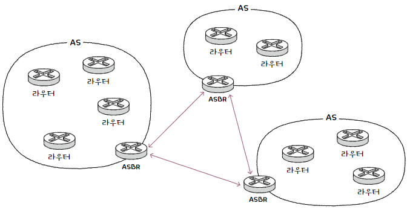

# 서브넷과 서브넷 마스크

## 서브넷&#x20;

> IP 주소의 네트워크 주소로 구분 가능한 네트워크의 부분 집합입니다. \
> 서브닛에리고 줄여서 부르기도 합니다.&#x20;

## 서브넷 마스크&#x20;

> 클래스리스 주소 체계에서 네트워크와 호스트를 구분하는 수단으로 사용합니다.\
> 네트워크 주소는 1, 호스트 주소는 0으로 표기합니다.&#x20;

### A, B, C의 기본 서브넷 마스크&#x20;

<table><thead><tr><th width="160">class</th><th>subnet mask</th><th data-hidden></th></tr></thead><tbody><tr><td>A</td><td>255.0.0.0</td><td></td></tr><tr><td>B</td><td>255.255.0.0</td><td></td></tr><tr><td>C</td><td>255.255.255.0 </td><td></td></tr></tbody></table>

## 서브네팅&#x20;

> 서브넷 마스크를 이용해 클래스를 원하는 크기로 더 잘게 쪼개어 사용하는 것을 의미합니다.&#x20;

### AND 연산&#x20;

> 서브넷 마스크를 이용해 네트워크 주소와 호스트 주소를 구분 짓는 방법입니다.&#x20;

<figure><figcaption></figcaption></figure>

* 사용된 서브넷 마스크에서 0이 8개 이므로 호스트 주소는 8비트로 표현 가능합니다.&#x20;
* 실제로 할당 가능한 IP 주소는 아래의 두개 주소를 제외한 254개입니다.&#x20;
  * 호스트 주소가 모두 0인 네트워크 192.168.219.0&#x20;
  * 호스트 주소가 모두 1인 네트워크 192.168.219.255&#x20;
